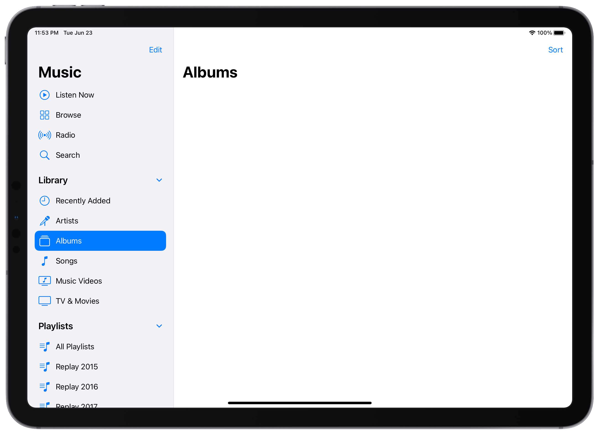

# Sidebar iOS 14

This is a sample project demonstrating how to implement the new Sidebar UI on an iPad app using Swift. It tries to mimic the UI of the new Music app on iPadOS 14.0:

It contains just the code required to create the UI, and it was based on the Apple's sample project  [Implementing Modern Collection Views](https://developer.apple.com/documentation/uikit/views_and_controls/collection_views/implementing_modern_collection_views).

## TO-DO

- [ ] Customize the accent color.
- [ ] Maintain selection when contracting/expanding a section.
- [x] Revert to tab bar based navigation on compact layouts, and on the iPhone.

## Documentation links

- [Human Interface Guidelines for the Sidebar](https://developer.apple.com/design/human-interface-guidelines/ios/bars/sidebars/)
- [Updated UISplitViewController documentation](https://developer.apple.com/documentation/uikit/uisplitviewcontroller)

## WWDC20 videos

- [Design for iPad](https://developer.apple.com/videos/play/wwdc2020/10206/)
- [Advances in UICollectionView](https://developer.apple.com/videos/play/wwdc2020/10097/)
- [Advances in diffable data sources](https://developer.apple.com/videos/play/wwdc2020/10045/)
- [Lists in UICollectionView](https://developer.apple.com/videos/play/wwdc2020/10026/)
- [Modern cell configuration](https://developer.apple.com/videos/play/wwdc2020/10027/)